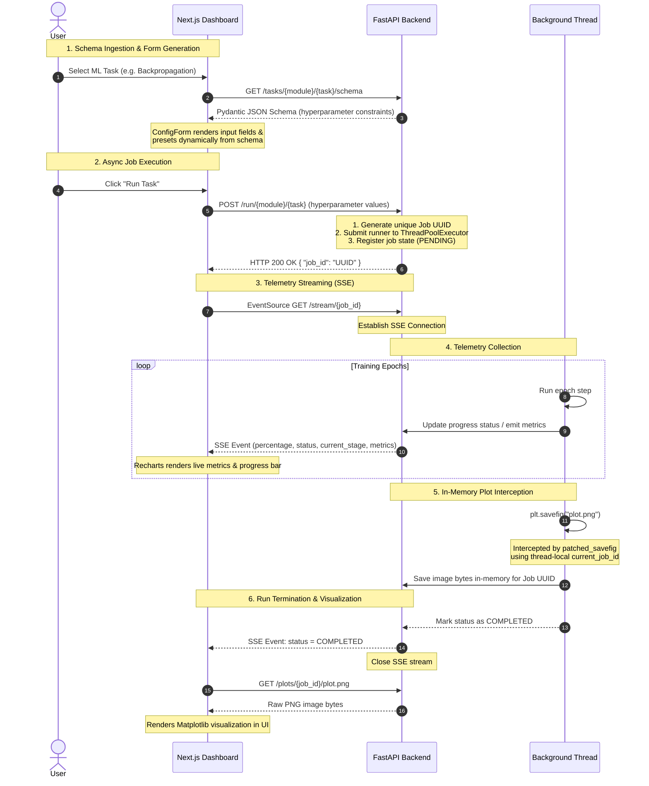

# Web Dashboard Architecture

The ML Workshop includes a real-time web dashboard built using **Next.js** (Frontend) and **FastAPI** (Backend). Unlike typical CRUD web applications, it operates as a real-time event-driven job execution and telemetry system.

---

## Architecture Diagram

The diagram below details the sequence of interactions between the user, the frontend dashboard, the FastAPI web server, and the concurrent background runner.

---

## Key Design Patterns

### 1. Dynamic Forms from Backend Schemas

Instead of hardcoding sliders and input validation on the frontend, the configuration controls are generated entirely dynamically:

- The backend defines task hyperparameters using **Pydantic** models.
- The frontend fetches this schema (`GET /tasks/{module}/{task}/schema`) and maps properties (like `minimum`, `maximum`, `default`, and type) directly to range sliders and numeric input fields inside [ConfigForm.tsx](file:///Users/samhuang/Playground/practice/ai-ml-workshop/frontend/app/components/ConfigForm.tsx).

### 2. ThreadPoolExecutor for Non-Blocking Async Web Loops

FastAPI's async event loop must never be blocked by heavy computation.

- Background training jobs run in a bounded CPU-scaled `ThreadPoolExecutor` ([main.py](file:///Users/samhuang/Playground/practice/ai-ml-workshop/backend/main.py#L62-L65)).
- This allows FastAPI to continue serving concurrent health-checks, handling cancellation requests, and streaming SSE events while heavy ML training runs on separate threads.

### 3. Server-Sent Events (SSE) for Real-Time Streaming

Rather than polling the server for progress, the frontend opens a long-lived HTTP connection using `EventSource` ([api.ts](file:///Users/samhuang/Playground/practice/ai-ml-workshop/frontend/app/api.ts#L72-L74)):

- The backend task runner sends progression payloads (current stage, training loss, validation accuracy, completed percentage) to an in-memory queue.
- The backend streams these events to the frontend ([main.py](file:///Users/samhuang/Playground/practice/ai-ml-workshop/backend/main.py#L265)) where the progress bar and Recharts line graph update in real-time.

### 4. Monkey-Patching Matplotlib (`plt.savefig`)

To display charts generated by Python tasks, the backend intercepts standard `savefig` calls:

- A patched implementation overrides `plt.savefig` ([main.py](file:///Users/samhuang/Playground/practice/ai-ml-workshop/backend/main.py#L43-L60)).
- When a background thread calls `plt.savefig(filename)`, the patch checks the thread-local storage for the active `job_id`, captures the figure bytes in-memory (`io.BytesIO`), and saves them in the in-memory registry.
- This avoids writing temporary files to the disk and ensures complete safety/isolation across concurrent runs.

### 5. Cooperative Cancellation

If a user realizes a configuration is wrong, they can abort it:

- Clicking **Cancel Task** sends a request to the backend `POST /cancel/{job_id}`.
- The backend updates the job registry's cancellation flag.
- The background thread's loop periodically polls this status using `HTTPProgressHook` and gracefully terminates execution when the cancel signal is detected.
