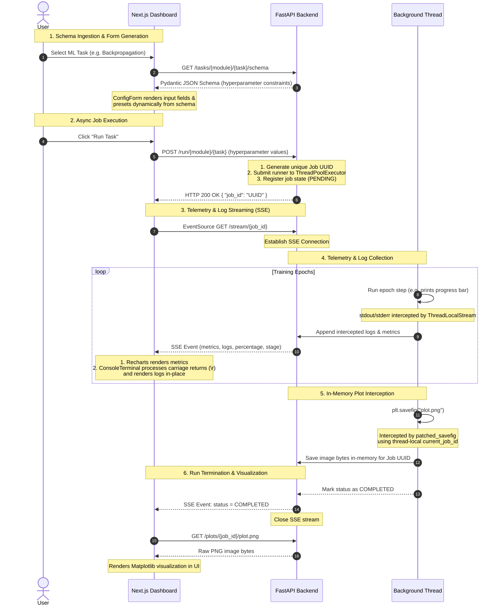

# Web Dashboard Architecture

The ML Workshop includes a real-time web dashboard built using **Next.js** (Frontend) and **FastAPI** (Backend). Unlike typical CRUD web applications, it operates as a real-time event-driven job execution and telemetry system.

---

## Architecture Diagram

The diagram below details the sequence of interactions between the user, the frontend dashboard, the FastAPI web server, and the concurrent background runner.

---

## Key Design Patterns

### 1. Dynamic Forms from Backend Schemas

Instead of hardcoding sliders and input validation on the frontend, the configuration controls are generated entirely dynamically:

- The backend defines task hyperparameters using **Pydantic** models.
- The frontend fetches this schema (`GET /tasks/{module}/{task}/schema`) and maps properties (like `minimum`, `maximum`, `default`, and type) directly to range sliders and numeric input fields inside [ConfigForm.tsx](file:///Users/samhuang/Playground/practice/ai-ml-workshop/frontend/app/components/ConfigForm.tsx).

### 2. ThreadPoolExecutor for Non-Blocking Async Web Loops

FastAPI's async event loop must never be blocked by heavy computation.

- Background training jobs run in a bounded CPU-scaled `ThreadPoolExecutor` ([main.py](file:///Users/samhuang/Playground/practice/ai-ml-workshop/backend/main.py#L62-L65)).
- This allows FastAPI to continue serving concurrent health-checks, handling cancellation requests, and streaming SSE events while heavy ML training runs on separate threads.

### 3. Server-Sent Events (SSE) for Real-Time Streaming

Rather than polling the server for progress, the frontend opens a long-lived HTTP connection using `EventSource` ([api.ts](file:///Users/samhuang/Playground/practice/ai-ml-workshop/frontend/app/api.ts#L72-L74)):

- The backend task runner sends progression payloads (current stage, training loss, validation accuracy, completed percentage) to an in-memory queue.
- The backend streams these events to the frontend ([main.py](file:///Users/samhuang/Playground/practice/ai-ml-workshop/backend/main.py#L265)) where the progress bar and Recharts line graph update in real-time.

### 4. Monkey-Patching Matplotlib (`plt.savefig`)

To display charts generated by Python tasks, the backend intercepts standard `savefig` calls:

- A patched implementation overrides `plt.savefig` ([main.py](file:///Users/samhuang/Playground/practice/ai-ml-workshop/backend/main.py#L43-L60)).
- When a background thread calls `plt.savefig(filename)`, the patch checks the thread-local storage for the active `job_id`, captures the figure bytes in-memory (`io.BytesIO`), and saves them in the in-memory registry.
- This avoids writing temporary files to the disk and ensures complete safety/isolation across concurrent runs.
- **Dynamic Security Whitelisting**: To protect the server from path traversal or unauthorized local file exposure, the `/plots/{job_id}/{filename}` endpoint validates request parameters using a dynamic whitelist. This whitelist is computed at startup by aggregating all registered task plot names, keeping the backend secure and the frontend configurations free of duplicate hardcoded lists.

### 5. Cooperative Cancellation

If a user realizes a configuration is wrong, they can abort it:

- Clicking **Cancel Task** sends a request to the backend `POST /cancel/{job_id}`.
- The backend updates the job registry's cancellation flag.
- The background thread's loop periodically polls this status using `HTTPProgressHook` and gracefully terminates execution when the cancel signal is detected.

### 6. Thread-Local Console Output Interception

To capture standard Python print statements and training progress bars (`tqdm`) on a per-job basis:

- The backend wraps `sys.stdout` and `sys.stderr` in a custom `ThreadLocalStream` class ([main.py](file:///Users/samhuang/Playground/practice/ai-ml-workshop/backend/main.py#L44)).
- Before a background thread executes a job, it registers the target `job_id` in its thread-local storage context.
- When the code prints text, the `ThreadLocalStream` captures the write, checks the thread-local storage for the active `job_id`, and appends the text to that job's memory log buffer.
- This isolates log outputs, preventing concurrent training jobs from corrupting or mixing standard output streams.

### 7. Terminal Emulation and Code Stacking Layout

To present a readable console and scrollable codebase view:

- **Carriage Return (`\r`) Processing**: Standard progress bars like `tqdm` output carriage returns to overwrite the current line. Because web browsers treat `\r` literally (causing massive text wrapping and log clutter), the frontend [ConsoleTerminal.tsx](file:///Users/samhuang/Playground/practice/ai-ml-workshop/frontend/app/components/progress-panel/ConsoleTerminal.tsx) parses lines and splits on `\r`, rendering only the final non-empty segment of each line.
- **Snappy Programmatic Scroll**: The console uses instant scroll resets (`scrollTop` assignment) to jump to the bottom upon receiving new logs, bypassing animated smooth scrolling which can trigger state-update loop bottlenecks.
- **Code Viewer Stacking & `h-fit` Height Alignment**: To keep line numbers aligned with the code text in [CodeViewer.tsx](file:///Users/samhuang/Playground/practice/ai-ml-workshop/frontend/app/components/progress-panel/CodeViewer.tsx) during horizontal scrolling, the Line Numbers Column is set to `sticky left-0 z-20 h-fit bg-[#0d0d0f]` and the code block `<pre>` is set to `relative z-10`. Setting `h-fit` prevents the flex container from stretching the sticky column's height to the viewport height (which leaves lines below the fold transparent); instead, it extends the solid background through the entire vertical scroll height.

---

## Comparison with Jupyter Notebooks

While Jupyter Notebooks are the standard for ML experimentation, this workshop uses a specialized web-dashboard architecture to address key limitations:

| Architectural Aspect    | Jupyter Notebooks                                                                                                                                                                              | ML Workshop Dashboard                                                                                                                                                               |
| :---------------------- | :--------------------------------------------------------------------------------------------------------------------------------------------------------------------------------------------- | :---------------------------------------------------------------------------------------------------------------------------------------------------------------------------------- |
| **Execution Model**     | **Synchronous & Blocking**: Running a cell locks the kernel, preventing you from inspecting variables, running other code, or tracking progress asynchronously without complex custom widgets. | **Asynchronous & Non-Blocking**: FastAPI submits tasks to a `ThreadPoolExecutor`, leaving the async loop free to serve health checks, stream live metrics, and handle cancellation. |
| **Telemetry & Visuals** | **Pull-based/Post-hoc**: Charts are rendered statically only after a cell finishes. Tracking live loss curves requires printing stdout text loops.                                             | **Push-based/Real-time**: Streams live telemetry via Server-Sent Events (SSE) into responsive front-end charts (Recharts) and dynamic step timelines.                               |
| **Process Isolation**   | **Multi-process (ZMQ)**: The frontend connects via WebSockets to a web server, which launches code in a separate Python process (Kernel) communicating via ZeroMQ.                             | **Thread-based (FastAPI)**: Web requests and background execution share the same process memory space, enabling lightweight thread-local registry hooks.                            |
| **Output Capturing**    | **Kernel Redirection**: Redirects standard output and register displays at the kernel engine level.                                                                                            | **Monkey-Patching**: Intercepts library calls (like `plt.savefig`) using thread-local storage to route image bytes in-memory straight to the client session.                        |
| **Cancellation**        | **Hard Interrupt**: Force-terminates the kernel process, which can crash the session or lose in-memory variables.                                                                              | **Cooperative Cancellation**: Gracefully signals background threads to exit loops safely via state polling.                                                                         |
